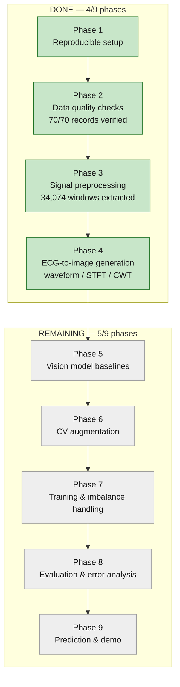
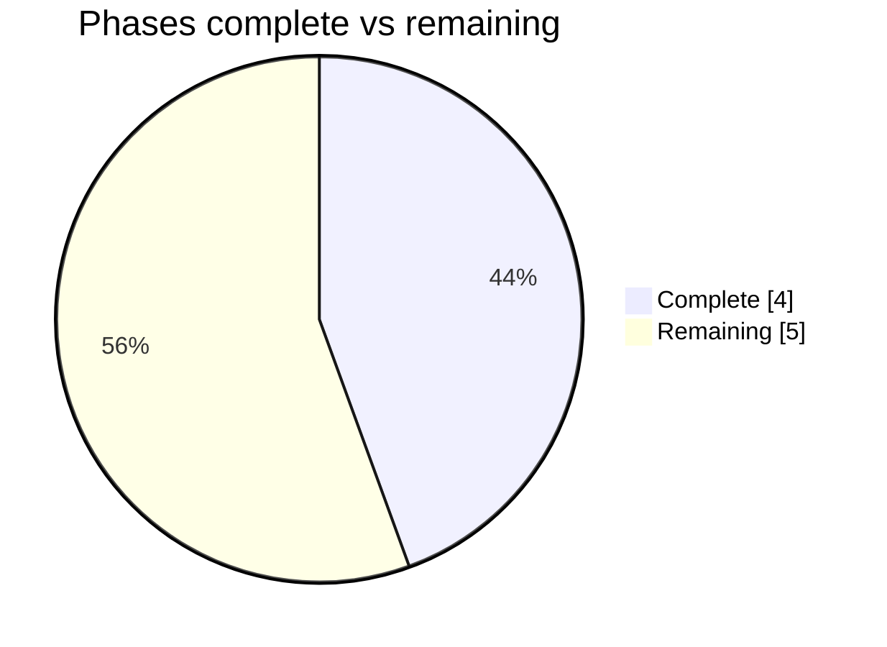

# Project Status

Progress against the 9 phases defined in `plan.md`. **4 of 9 phases complete (~44% by phase count)** — see the caveat below on why that understates remaining effort.

## Caveat on the percentage

Phase count isn't effort-weighted. Phases 1–4 (done) were mostly one-shot pipeline construction; Phases 5–8 (remaining) involve iterative model training, hyperparameter comparisons across 3 representations, and evaluation — typically the heavier half of a project like this by time spent, even though it's "only" 5 of 9 boxes. Treat ~44% as a phase-count milestone, not a time-remaining estimate.

## What's actually in place

- **Phase 1–2**: `config.yaml`, `uv` environment, git repo, dataset verified (70/70 records, checksums OK)
- **Phase 3**: `src/preprocessing.py`, `src/splits.py`, `src/build_dataset.py` — baseline removal, bandpass filter, artifact clipping, robust normalization, windowing with reject/flag logic; record-level stratified train/val/test split
- **Phase 4**: `src/representations.py`, `src/build_images.py` — waveform/STFT/CWT image generation for all 34,074 windows, `data/images/*.npz`, `notebooks/02_signal_to_image.ipynb`
- **Not started**: Phases 5–9 (`src/models.py`, `src/train.py`, `src/evaluate.py`, `src/predict.py`, `app/app.py` don't exist yet)
